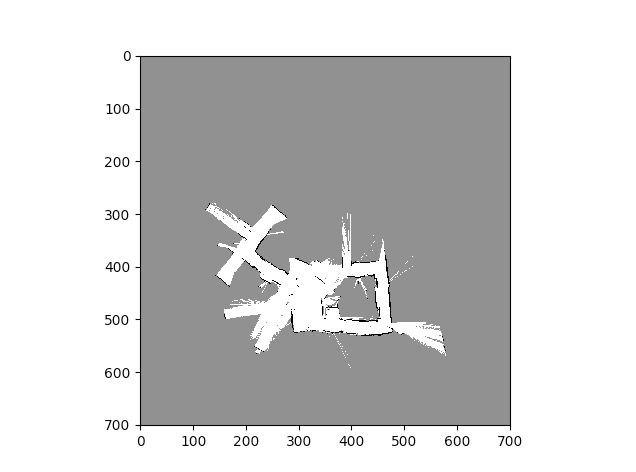

# Implement-SLAM-with-RGBD-measurements

Implement simultaneous localization and mapping (SLAM) using odometry,  inertial,  2-D laser
range, and RGBD measurements from a humanoid robot. Use the IMU, odometry, and laser measurements
to localize the robot and build a 2-D occupancy grid map of the environment.  Use the RGBD information
to color the floor of your 2-D map.

SLAM Results:

## Here is my readme file for this project. I am using Python3.6

load_data.py is the function loading the data sets, including lidar, joint, and cam data

main.py is my core code. Runing it you will get the plot for the testset data  map.

Particle_filter.py is the funtions which including softmax function, resampling function, and particle filter function

test_texture.py is for the texture mapping part.

